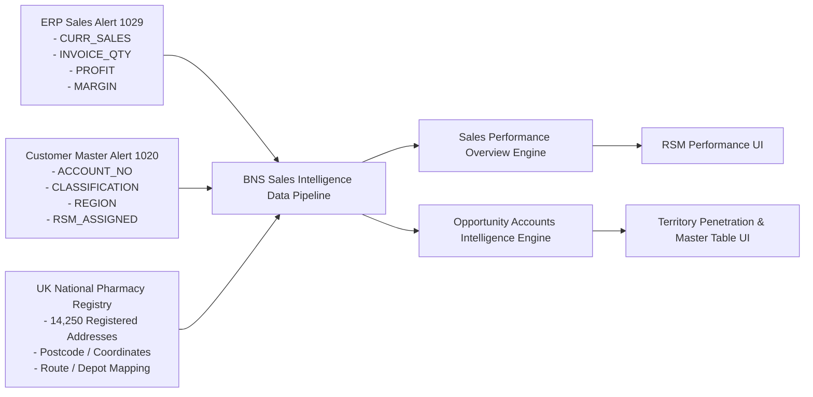

# Functional Specification: RSM Sales Dashboard
**Document Version:** 1.0  
**Project:** BNS Sales Intelligence Platform  
**Module:** Regional Sales Management (RSM) Analytics & Opportunity Account Intelligence  

---

## Document Control & Approvals

| Role | Name & Designation | Signature | Date |
| :--- | :--- | :--- | :--- |
| **Author** | **Amit Porwal**<br>IT - Business Analyst | ______________________________ | ____________ |
| **Reviewer** | **Amit Sanandiya**<br>IT – Project Manager | ______________________________ | ____________ |
| **Approver** | **Ajay Soin / Deepak Pariyani**<br>Sales Manager / Team Leader | ______________________________ | ____________ |

---

## 1. Introduction

The **RSM Sales Dashboard** is an enterprise operational and strategic analytical module engineered for **BNS Distribution** as a core component of the **BNS Sales Intelligence Platform**. The primary objective of this module is to empower Regional Sales Managers (RSMs), Sales Directors, and Commercial Leadership with dual-engine business intelligence:

1. **Sales Performance Overview:** Real-time visibility into regional revenue achievement, product category mix, rolling 3-month benchmark comparisons, Year-over-Year (YoY) customer growth, account classification profiles, and customer retention/declining account surveillance.
2. **Opportunity Accounts & Market Penetration:** Comprehensive spatial, logistical, and territory-level intelligence mapping the entire UK retail and independent pharmacy market (~14,250 locations) against active BNS trading accounts to uncover market gaps, prioritize prospect outreach, track depot penetration, and accelerate new account acquisition.

---

## 2. Scope

### In-Scope
The scope of the RSM Sales Dashboard encompasses the complete UI wireframe architecture, multi-dimensional filter logic, calculation engines, data source mapping (Alert 1029 ERP Sales Data, Alert 1020 Customer Master, Alert 286A Live Feeds), and interactive reporting interfaces for:

1. **Sub-Module Navigation:** Instant toggle between **Sales Performance Overview** and **Opportunity Accounts**.
2. **Executive KPI Engines:**
   - Active customer accounts, monthly new account openings vs. monthly targets, rolling 3-month average benchmark comparisons, and Month-to-Date (MTD) sales totals.
   - National pharmacy universe metrics: Total UK Pharmacies, Existing Acquired Customers, Untraded Opportunity Accounts, and Current Month New Account Openings.
3. **Product Category & Benchmark Comparative Analytics:**
   - Granular category comparison (Generic, PI, Ethical, OTC, CD, Perfumes, Syri Sales) comparing Current Month Performance against Previous 3-Month Daily Averages.
   - Core financial matrix comparison (Sales Revenue, Box Throughput, Gross Profit, Gross Margin %, Syri Sales).
   - YoY Category Comparison Bar Chart (2025 Prior Year vs. 2026 Current Year with Old Account Growth, Old Account Decline, and New Account Contribution stacks).
   - Category Revenue Contribution Share % Distribution.
4. **Customer Account Analytics & Segmentation:**
   - Account portfolio composition (Total Active, Independent vs. Group Accounts, New This Month, Closed/Dormant).
   - 12-Month Rolling Account Acquisition Trend vs. Target.
   - Customer Classification Distribution (Class A, Class B, Class C, Class D).
5. **Customer Surveillance & Drill-Down Tables:**
   - **Top Performing Customers Table:** Ranked by revenue with team attribution, box volume, Top 200 Generic lines, Top 100 PI lines, and gross profit.
   - **Bottom Performing Customers (Declining Accounts Table):** Tracking accounts with significant negative variance (Sales drop, Decline %, Last order date).
6. **Opportunity Territory & Route Penetration Engine:**
   - Interactive hierarchical drill-down bar chart (**UK National → Region → City → Route**).
   - Route-level opportunity rankings (Route 01 through Route 08).
   - RSM Leaderboard ranking RSMs by Total Assigned Accounts, Acquired Customers, Opportunity Accounts, and Penetration %.
   - Depot Performance Stacked Distribution & Summary Table (Depots 1 to 5).
7. **Automated AI/Rule-Based Opportunity Insights:**
   - Dynamic alert cards highlighting top opportunity regions, RSM pipeline pools, lowest penetration depots, priority sales routes, and high-priority prospect clusters.
8. **Master Directory & Export Sub-system:**
   - Searchable, filterable, sortable, and paginated master table of all pharmacy locations with priority flags and potential sales estimates.
   - Multi-format client-side export engine (CSV, Excel HTML Blob, PDF print layout).

### Out of Scope
- Direct order placement or transactional cart checkout post-opportunity conversion (handled by EDI / Web / Telesales order capture modules).
- Direct modification of third-party external Pharmacy Management Systems (PMR).
- Automated credit limit authorization within the BI interface (governed by ERP Credit Control).

---

## 3. Abbreviations

| Abbreviation | Description |
| :--- | :--- |
| **RSM** | Regional Sales Manager |
| **TL** | Team Leader (Telesales & Online Operations) |
| **KPI** | Key Performance Indicator |
| **MTD** | Month to Date |
| **YTD** | Year to Date |
| **YoY** | Year over Year (e.g., 2025 vs. 2026) |
| **GM / Margin %** | Gross Margin Percentage: `(Gross Profit / Sales Revenue) * 100` |
| **COGS** | Cost of Goods Sold |
| **EDI** | Electronic Data Interchange |
| **PMR** | Pharmacy Management System (e.g., Dataplast, Cambrian, Cascade, PharmAssist) |
| **DT** | Drug Tariff Products |
| **NDT** | Non-Drug Tariff Products |
| **CD** | Controlled Drugs |
| **PI** | Parallel Import Products |
| **OTC** | Over-The-Counter Products |
| **AOV** | Average Order Value: `Sales / Orders` |
| **CPO** | Cost Per Order / Calls Per Order |
| **BNS** | B&S Group Distribution |
| **FS** | Functional Specification |
| **DS** | Design Specification |

---

## 4. Dashboard Layout, Navigation & Filter Engine

### 4.1 Sub-Module Navigation Architecture
The RSM module contains a primary sub-tab navigation header allowing users to toggle between two operational views:
- **`📊 Sales Performance Overview` (Default):** Evaluates operational sales performance, category dynamics, target achievement, and account attrition.
- **`🎯 Opportunity Accounts`:** Provides strategic territorial intelligence, market penetration rates, and target prospect databases across the UK.

```
+----------------------------------------------------------------------------------------------------+
|  RSM Sales Analytics                                 [ 📊 Sales Performance ] [ 🎯 Opportunity ]   |
+----------------------------------------------------------------------------------------------------+
|  [VIEW 1: Sales Performance Overview]                                                              |
|  - Top Filter Bar (RSM Selector, Date Filter, Team Filter, Category, Classification, Account Type) |
|  - 4 Executive KPI Cards                                                                           |
|  - Product Category Sales Table (Current vs 3M Avg) | Sales Comparison Table (Current vs 3M Avg)   |
|  - YoY Category Stacked Bar Chart                   | Current Month Category Share % Bar Chart     |
|  - Customer Account Analytics (Mini Cards, Account Growth Trend vs Target, Class A-D Distribution) |
|  - Bottom Performing / Declining Accounts Table     | Top Performing Customers Table               |
+----------------------------------------------------------------------------------------------------+
|  [VIEW 2: Opportunity Accounts & Market Penetration]                                               |
|  - Global Opportunity Filter Bar (Country, Region, Postcode, Route, RSM, Depot, Reset Button)      |
|  - 4 Market Universe KPI Cards (Total UK, Acquired, Opportunity Gap, New Accounts Opened)          |
|  - Account Growth Trend Bar Chart (12 Months Target vs Actual)                                     |
|  - Opportunity by Location (Hierarchy Drill-Down)   | Opportunity Accounts by Route Bar Chart      |
|  - RSM Leaderboard Table (Penetration %)            | Depot Stacked Chart & Depot Breakdown Table  |
|  - Automated Opportunity Performance Insights Cards                                                |
|  - Opportunity Master Directory Table (Search, Status Filter, Priority Filter, Export Menu, Paging)|
+----------------------------------------------------------------------------------------------------+
```

---

### 4.2 Filter Engine Specifications

#### Filter Set 1: Sales Performance Overview Filters

| Filter Field | UI Element | Options / Values | Logic & Behavior |
| :--- | :--- | :--- | :--- |
| **RSM Selector** | Single Select Dropdown | - All RSM (Default)<br>- Ajay Soin<br>- Graham<br>- Penny<br>- Ricky<br>- David | Slices all overview KPIs, category benchmarks, customer tables, and growth trends to the assigned territory of the selected Regional Sales Manager. |
| **Date Range Filter** | Single Select Dropdown + Dynamic Date Inputs | - Current month (Default)<br>- Previous Month<br>- Custome Date (Dynamic To/From pickers) | Controls the active analysis period. Selecting **Custome Date** reveals two `type="date"` inputs (`customDateFrom_page_team` and `customDateTo_page_team`). |
| **Team Leader** | Single Select Dropdown | - All Teams (Default)<br>- Amit Team<br>- Sanket Team<br>- Jaishali Team<br>- Ayaz Team<br>- Kam Team<br>- Prashant Team | Slices overview performance by the supporting Telesales Team Leader assigned to regional accounts. |
| **Product Category** | Single Select Dropdown | - All Categories (Default)<br>- Generic<br>- PI<br>- Ethical<br>- OTC<br>- CD<br>- Perfumes | Filters category sales tables and associated charts. |
| **Customer Classification** | Single Select Dropdown | - All Classifications (Default)<br>- Class A (Top spenders)<br>- Class B<br>- Class C<br>- Class D | Slices customer analytics and declining/top account tables by customer tier. |
| **Account Type** | Single Select Dropdown | - Independent & Group (Default)<br>- Independent<br>- Group Account | Slices data between standalone community pharmacies and multi-branch pharmacy chains/buying groups. |

---

#### Filter Set 2: Global Opportunity Accounts Filter Engine

| Filter Field | UI Element | Values / Data Source | Logic & Behavior |
| :--- | :--- | :--- | :--- |
| **Country** | Single Select Dropdown | - All Countries (Default)<br>- England<br>- Scotland<br>- Wales<br>- Northern Ireland | Filters national market universe by UK nation. |
| **Region** | Single Select Dropdown | - All Regions (Default)<br>- London<br>- Midlands<br>- North West<br>- Yorkshire<br>- South East<br>- Scotland | Filters market data to specific geographic region. Dynamically filters the **County** and **City** dropdowns. |
| **Postcode Search** | Text Input | Case-insensitive alphanumeric search (e.g., `EC1A`, `M1`, `B15`) | Live sub-string match on pharmacy postcodes. |
| **Route Number** | Single Select Dropdown | - All Routes (Default)<br>- Route 01 through Route 08 | Filters data by BNS internal logistics delivery van routes. |
| **RSM** | Single Select Dropdown | - All RSMs (Default)<br>- Ajay Soin, Graham, Penny, Ricky, David | Filters prospect and acquired database by assigned RSM territory manager. |
| **Depot** | Single Select Dropdown | - All Depots (Default)<br>- Depot 1 - London Central<br>- Depot 2 - Midlands North<br>- Depot 3 - North West Hub<br>- Depot 4 - Scotland Regional<br>- Depot 5 - South East Central | Slices market penetration by primary fulfilling distribution warehouse. |
| **Reset Button** | Action Button | `🔄 Reset Filters` | Clears all 7 global filters, resets the hierarchy drill-down state to `UK (All)`, and recalculates all charts/tables. |

---

## 5. Functional Requirements — Sub-Module 1: Sales Performance Overview

### 5.1 Overview Executive KPI Cards

| Component ID | **RSM-KPI-01** |
| :--- | :--- |
| **Component Name** | Executive Performance KPI Cards |
| **Priority** | High |
| **Target Role** | RSM, Commercial Director, Sales Manager |
| **Purpose** | Immediate high-level snapshot of active customer volume, monthly acquisition vs. target, 3-month benchmark variances, and cumulative MTD revenue. |

| Metric Name | Type | Display Value & Format | Calculation Logic & Data Source | Visual Rules |
| :--- | :--- | :--- | :--- | :--- |
| **Total Active Accounts** | KPI Card | Integer (e.g., `1,284`) | `COUNT(DISTINCT Account_No)` with at least 1 invoiced order in the current active period.<br>**Source:** Alert 1029 / Customer Master. | Primary Blue theme (`--primary`). |
| **New Account Opens vs Target** | Composite KPI Card | Actual: `38`<br>Target: `50` | `Actual = COUNT(DISTINCT New_Accounts_Opened_MTD)`<br>`Target = Monthly_RSM_Target_Quota` (Default: 50).<br>**Source:** Customer Master Creation Date. | Green theme (`--success`) with vertical danger divider (`--danger`) separating Actual from Target value. |
| **Avg Sales (Prev 3M vs Current Month)** | KPI Card | Currency Comparison (e.g., `£550K vs £556K`) | `Prev_3M_Avg = SUM(M-1 + M-2 + M-3 Sales) / 3`<br>`Curr_Month_Sales = Total Ingested Current Month Sales`.<br>**Source:** Alert 1029 `Curr_Sales`. | Cyan theme (`--cyan`). Displays positive or negative variance. |
| **Total Sales Till Date** | KPI Card | Currency (e.g., `£556K`) | `SUM(Curr_Sales)` for the selected RSM / month to date.<br>**Source:** Alert 1029. | Purple theme (`--purple`) with subtitle badge `"Current month"`. |

---

### 5.2 Product Category Sales Performance Table

| Component ID | **RSM-TBL-01** |
| :--- | :--- |
| **Component Name** | Product Category Sales Table (Current Month vs. Prev 3-Month Avg) |
| **Priority** | High |
| **Purpose** | Granular variance tracking across all major pharmaceutical therapeutic/product categories against historical 3-month averages. |

| Column Name | Type | Data / Calculation Logic | Formatting & Visual Rules |
| :--- | :--- | :--- | :--- |
| **Matrix** | Text Column | Product Category Names:<br>1. Generic<br>2. Ethical<br>3. PI (Parallel Import)<br>4. OTC (Over-The-Counter)<br>5. CD (Controlled Drugs)<br>6. Perfumes<br>7. **Total Sales**<br>8. **Syri Sales** | Standard bold text for summary rows (**Total Sales**, **Syri Sales**). |
| **3 Month Average** | Currency Column | `SUM(Sales_M-1 + Sales_M-2 + Sales_M-3) / 3` for each category.<br>**Source:** Alert 1029 historical records. | Right-aligned currency format (`£XXXK` or `£X.XXM`). |
| **Current month Average** | Currency Column | `Total_Category_Sales_MTD`<br>**Source:** Alert 1029 `Curr_Sales`. | Right-aligned currency format (`£XXXK` or `£X.XXM`). |
| **Difference** | Currency Variance Column | `Difference = Current_Month_Sales - 3_Month_Average` | If `Difference >= 0`: Green text (`+£XXK`).<br>If `Difference < 0`: Red text (`-£XXK`). |
| **Status** | Status Badge Column | Qualitative indicator based on variance sign. | If `Difference >= 0`: Green dot (`●`) + `"Better"`.<br>If `Difference < 0`: Red dot (`●`) + `"Below"`. |

---

### 5.3 Core Matrix Sales Comparison Table

| Component ID | **RSM-TBL-02** |
| :--- | :--- |
| **Component Name** | Sales Comparison Table (Current Month vs. Prev 3-Month Avg) |
| **Priority** | High |
| **Purpose** | Evaluates overall operational throughput including financial revenue, box/unit volume, gross profit, and margin percentages. |

| Metric (Matrix) | Previous 3-Month Avg | Current Month Value | Difference Formula | Visual Indicator Rule |
| :--- | :--- | :--- | :--- | :--- |
| **Sales** | `£487K` | `£556K` | `+£69K` | Green dot (`● Better`) |
| **Boxes Sold** | `21,600` | `24,820` | `+3,220` | Green dot (`● Better`) |
| **Gross Profit** | `£96K` | `£111K` | `+£15K` | Green dot (`● Better`) |
| **Gross Margin** | `19.7%` | `19.9%` | `+0.2pp` | Green dot (`● Better`) |
| **Syri Sales** | `£120K` | `£122K` | `+£20K` | Green dot (`● Better`) |

---

### 5.4 Sales by Category Bar Chart (2025 vs. 2026 Stacked Comparison)

| Component ID | **RSM-CHT-01** |
| :--- | :--- |
| **Component Name** | Sales by Category — 2025 Aug vs. 2026 Aug Stacked Bar Chart |
| **Priority** | High |
| **Chart Type** | Stacked Bar Chart (Chart.js) |
| **Purpose** | Visualizes Year-over-Year revenue expansion and contraction per category by isolating sales retained from old accounts, growth on existing accounts, drops from existing accounts, and new account acquisitions. |

| Dataset Layer | Color Code | Stack Key | Description & Formula |
| :--- | :--- | :--- | :--- |
| **Previous Account Sales (2025)** | `#94a3b8` (Slate Grey) | `2025` | Total baseline category sales generated in prior year same month. |
| **Old Accounts Base Sales (2026)** | `#1a56db` (Primary Blue) | `2026` | Retained recurring sales in current year from accounts active in 2025. |
| **Sales Growth from Old Accounts** | `#10b981` (Emerald Green) | `2026` | Incremental upsell / expansion revenue generated from existing accounts. |
| **Sales Drop from Old Accounts** | `#ef4444` (Crimson Red) | `2026` | Lost category revenue due to account volume contraction. |
| **New Account Sales (2026)** | `#06b6d4` (Cyan) | `2026` | Revenue generated from newly acquired customer accounts opened in 2026. |

---

### 5.5 Current Month Category Share % Bar Chart

| Component ID | **RSM-CHT-02** |
| :--- | :--- |
| **Component Name** | Current Month Line Category Sales Share % |
| **Priority** | Medium |
| **Chart Type** | Multi-colored Horizontal/Vertical Bar Chart |
| **Purpose** | Displays percentage contribution of each product category to total sales. |
| **Logic** | `Category_Share_% = (Category_Sales / Total_Sales) * 100`<br>- Generic: **51.0%**<br>- Ethical: **14.7%**<br>- OTC: **12.2%**<br>- PI: **8.6%**<br>- CD: **6.8%**<br>- Perfumes: **6.5%** |

---

### 5.6 Customer Account Analytics Sub-Section

#### 1. Account Portfolio Mini Badges
- **Total Active Accounts:** `1,284` (Invoiced accounts)
- **Independent Accounts:** `892` (Standalone community pharmacies)
- **Group Accounts:** `392` (Chains / Buying group members)
- **New This Month:** `38` (Accounts activated in current month)
- **Closed Accounts:** `12` (Inactive / terminated accounts)

#### 2. Account Growth Trend vs. Target (`rsmAcctGrowthChart`)
- **Chart Type:** Grouped / Overlay Bar Chart across 12 rolling months.
- **Dataset 1 (Target):** Blue bar (`#1a56db`), constant target quota (50 accounts/month).
- **Dataset 2 (New Accounts):** Dynamic color-coded bar:
  - **Green (`#10b981`):** If `New_Accounts >= Target`.
  - **Red (`#ef4444`):** If `New_Accounts < Target`.

#### 3. Account Classification Distribution (`rsmAcctClassChart`)
- **Chart Type:** Bar Chart across customer tiers.
- **Classes & Counts:**
  - **Class A:** 284 accounts (`#1a56db`) — Top tier monthly spenders (£5K+ / month).
  - **Class B:** 420 accounts (`#10b981`) — Mid-high tier (£2K - £5K / month).
  - **Class C:** 380 accounts (`#f59e0b`) — Mid-low tier (£500 - £2K / month).
  - **Class D:** 200 accounts (`#ef4444`) — Low tier (< £500 / month).

---

### 5.7 Customer Surveillance & Drill-Down Tables

#### 1. Bottom Performing Customers — Declining Accounts (`rsmDecliningTable`)

| Component ID | **RSM-TBL-03** |
| :--- | :--- |
| **Purpose** | Immediate alert list of accounts experiencing sharp turnover decline, requiring urgent RSM field intervention. |
| **Search Filter** | Live client-side text input (`#rsmBotSearch`) filtering customer name. |

| Column | Type | Formula / Logic | Display & Styling |
| :--- | :--- | :--- | :--- |
| **Customer Name** | Text | Account legal/trading name. | Bold text (`font-semibold`). |
| **Prev Month Sales** | Currency | Total sales from previous calendar month. | Right-aligned currency (`£XX,XXX`). |
| **Current Month Sales** | Currency | Total sales MTD. | Right-aligned currency (`£XX,XXX`). |
| **Difference** | Currency | `Current_Sales - Prev_Month_Sales` | Bold red text (`text-danger`, `-£X,XXX`). |
| **Decline %** | Percentage | `((Current_Sales - Prev_Sales) / Prev_Sales) * 100` | Red badge (`badge-danger`, e.g., `-34.4%`). |
| **Last Order Date** | Date | Timestamp of most recent invoiced order. | Subtle text (`color: var(--text2)`). |

---

#### 2. Top Performing Customers Table (`rsmTopTable`)

| Component ID | **RSM-TBL-04** |
| :--- | :--- |
| **Purpose** | Highlights leading revenue-generating accounts across the territory to evaluate key account retention and cross-selling. |
| **Search Filter** | Live client-side text input (`#rsmTopSearch`) filtering name or assigned telesales team. |

| Column | Type | Description | Display / Rules |
| :--- | :--- | :--- | :--- |
| **Rank** | Badge / Number | Ordinal rank by sales volume. | Top 3 display medals (`🥇`, `🥈`, `🥉`), subsequent ranks display numeric badge (`4`, `5`...). |
| **Customer Name** | Text | Registered pharmacy trading name. | Bold font. |
| **Acct No.** | Code Badge | Unique ERP Account code (e.g., `ACC-1042`). | Primary blue badge (`badge-primary`). |
| **Team** | Text Badge | Assigned Telesales Team (e.g., `Amit`, `Sanket`). | Purple badge (`badge-purple`). |
| **Orders** | Integer | Invoiced order count MTD. | Numeric integer. |
| **Top 200 Line** | Integer | Count of high-velocity top 200 Generic SKUs purchased. | Numeric integer. |
| **Top 100 PI** | Integer | Count of top 100 Parallel Import SKUs purchased. | Numeric integer. |
| **Total Sales** | Currency | Total revenue generated MTD. | Bold currency (`£XX,XXX`). |
| **Gross Profit** | Currency | Total gross profit generated MTD. | Standard currency (`£XX,XXX`). |
| **Last Purchase** | Date | Date of latest order. | Standard date (`DD MMM YYYY`). |

---

## 6. Functional Requirements — Sub-Module 2: Opportunity Accounts & Market Penetration

### 6.1 Opportunity KPI Summary Cards

| Component ID | **OPP-KPI-01** |
| :--- | :--- |
| **Purpose** | Displays macro market penetration metrics and market gap estimates for the UK territory. |
| **Scale Engine** | Dynamically scales filtered sample records to the representative 14,250 UK pharmacy universe. |

| Card Name | Metric Display | Sub-Text / Indicator | Mathematical Formula |
| :--- | :--- | :--- | :--- |
| **Total Pharmacies** | `14,250` | Total Market Universe | `COUNT(All_Registered_UK_Pharmacies)` in filtered region/route. |
| **Existing Customers (Acquired)** | `3,420` | `24.0% Market Share` | `COUNT(Pharmacies WHERE Status == 'Existing Customer')` |
| **Opportunity Accounts** | `10,830` | `76.0% Market Gap` | `Total_Pharmacies - Existing_Customers` |
| **New Accounts Open** | Variable (e.g. `38`) | MTD New Activations | `COUNT(Pharmacies Acquired in Current Calendar Month)` |

---

### 6.2 Interactive Opportunity by Location Drill-Down Bar Chart

| Component ID | **OPP-CHT-01** |
| :--- | :--- |
| **Component Name** | Opportunity Accounts by Location |
| **Chart Type** | Interactive Drill-Down Bar Chart (Chart.js) |
| **Hierarchy Levels** | **Level 1: UK National** (Grouped by Region: London, Midlands, North West, Yorkshire, South East, Scotland)<br>↓ Click Bar<br>**Level 2: Region** (Grouped by Cities in clicked region)<br>↓ Click Bar<br>**Level 3: City** (Grouped by Delivery Routes in clicked city) |
| **Interactive Actions** | 1. **Click Bar:** Automatically sets the corresponding filter (Region, City, or Route) and re-renders chart at child level.<br>2. **Breadcrumb Navigation:** Header breadcrumb (`UK (All) › Region: London › City: Westminster`) allows 1-click step-back or full reset.<br>3. **Tooltip:** Displays Total Accounts, Acquired Customers, Opportunity Accounts, and calculated Penetration Rate %. |

---

### 6.3 Opportunity Accounts by Route Ranking Bar Chart

| Component ID | **OPP-CHT-02** |
| :--- | :--- |
| **Component Name** | Opportunity Accounts by Route |
| **Chart Type** | Horizontal Bar Chart (Sorted descending by opportunity count) |
| **Purpose** | Enables logistics and sales reps to target delivery routes with the highest concentration of untraded prospects. |
| **X-Axis** | Count of Opportunity Accounts (`#f59e0b` amber bars). |
| **Y-Axis** | Route Names (`Route 01` through `Route 08`). |

---

### 6.4 Opportunity Accounts by RSM Leaderboard Table

| Component ID | **OPP-TBL-01** |
| :--- | :--- |
| **Component Name** | Opportunity Accounts by RSM Leaderboard |
| **Priority** | High |
| **Purpose** | Benchmarks RSM territory coverage, acquired customer counts, untraded opportunity volume, and market penetration percentages. |

| Column | Type | Description / Formula | Visual Rules |
| :--- | :--- | :--- | :--- |
| **Rank** | Badge | Rank 1 to N based on highest Acquired Customer count. | Rank 1 (`rank-1` Gold), Rank 2 (`rank-2` Silver), Rank 3 (`rank-3` Bronze). |
| **RSM Name** | Text | Assigned RSM full name. | Bold font. |
| **Assigned** | Integer | Total pharmacy accounts assigned to RSM territory. | Formatted integer (`X,XXX`). |
| **Existing** | Integer | Number of actively trading customers. | Green bold text (`text-success`). |
| **Opportunity** | Integer | Number of non-trading target accounts. | Orange bold text (`text-orange`). |
| **Acq %** | Percentage | `(Existing / Assigned) * 100` | Bold percentage (`XX.X%`). |
| **Penetration** | Progress Bar + % | Visual progress bar representing market penetration. | Purple progress bar (`.progress-bar.purple`) + text label (`XX.X%`). |

---

### 6.5 Opportunity Accounts by Depot Stacked Chart & Table

| Component ID | **OPP-CHT-03** & **OPP-TBL-02** |
| :--- | :--- |
| **Component Name** | Opportunity Accounts by Depot (Chart & Summary Table) |
| **Chart Type** | Stacked Bar Chart (`Existing Customers` in Cyan `#06b6d4`, `Opportunity Accounts` in Orange `#f97316`). |
| **Table Columns** | 1. **Depot Name:** Full warehouse depot title (e.g., `Depot 1 - London Central`).<br>2. **Total:** Total market pharmacies in depot service radius.<br>3. **Existing:** Active trading accounts (`text-primary`).<br>4. **Opportunity:** Non-trading prospect accounts (`text-orange`).<br>5. **Penetration %:** `(Existing / Total) * 100` (`text-purple font-bold`). |

---

### 6.6 Automated Opportunity & Market Penetration Insights Engine

The system evaluates the active dataset dynamically and renders 5 automated insight alert cards:

```
+---------------------------------------------------------------------------------------------------+
| 📍 Top Opportunity Region                                                                         |
|    London region holds the largest acquisition potential with 3,840 non-trading pharmacies.       |
+---------------------------------------------------------------------------------------------------+
| 👥 RSM Acquisition Potential                                                                      |
|    Ajay Soin has the largest opportunity pool with 2,980 untraded target accounts.                |
+---------------------------------------------------------------------------------------------------+
| 📦 Lowest Market Penetration Depot                                                                |
|    Depot 4 - Scotland Regional has the lowest penetration rate at 18.2%. Dedicated BD focus rec. |
+---------------------------------------------------------------------------------------------------+
| 🚚 Priority Business Development Route                                                            |
|    Route 04 requires immediate sales attention with 1,640 non-trading customer prospects.          |
+---------------------------------------------------------------------------------------------------+
| 🎯 High Priority Prospect Concentration                                                           |
|    3,420 high-priority non-trading pharmacies identified for immediate sales visits this month.   |
+---------------------------------------------------------------------------------------------------+
```

---

### 6.7 Opportunity Master Directory Table

| Component ID | **OPP-TBL-03** |
| :--- | :--- |
| **Component Name** | Opportunity Accounts Master Directory |
| **Priority** | High |
| **Features** | Multi-field search, status filter, priority filter, multi-format export, column sorting, pagination. |

| Column | Type | Sortable | Description & UI Rules |
| :--- | :--- | :---: | :--- |
| **Pharmacy Name** | Text | Yes (`↕`) | Legal / trading name of the pharmacy branch. |
| **Code** | Badge | Yes (`↕`) | Unique master pharmacy code (`PHARM-XXXX`) in purple badge. |
| **Location / County**| Text | Yes (`↕`) | County name (e.g., Greater London, Warwickshire). |
| **City** | Text | Yes (`↕`) | City name (e.g., London, Manchester, Glasgow). |
| **Region** | Text | Yes (`↕`) | Geographic region name. |
| **Route** | Text | Yes (`↕`) | Internal delivery route number (`Route 01` - `Route 08`). |
| **RSM** | Text | Yes (`↕`) | Assigned Regional Sales Manager name. |
| **Depot** | Text | Yes (`↕`) | Primary dispatch distribution center. |
| **Status** | Badge | Yes (`↕`) | `Existing Customer` (Green badge) or `Opportunity Account` (Amber badge). |
| **Last Contact** | Date / Text | Yes (`↕`) | Most recent contact date (`YYYY-MM-DD`) or `N/A`. |
| **Priority** | Badge | Yes (`↕`) | `High` (Red badge), `Medium` (Orange badge), `Low` (Blue badge). |
| **Potential Sales** | Currency | Yes (`↕`) | Estimated annual purchasing potential (`£XX,XXX`). |

---

### 6.8 Multi-Format Export Engine

The master directory includes a dropdown action menu providing one-click client-side export generation:

| Export Option | File Format | Technical Implementation | Data Ingestion Scope |
| :--- | :--- | :--- | :--- |
| **Export Opportunity (CSV)** | `.csv` | `data:text/csv;charset=utf-8` with dynamic URI encoding. | All active filtered rows with status `Opportunity Account`. |
| **Export Opportunity (Excel)**| `.xls` | XML/HTML Table Blob (`application/vnd.ms-excel`). | Full tabular layout with styled header cells. |
| **Export Existing (Excel)** | `.xls` | HTML Table Blob for active customers only. | Filtered active trading customer list. |
| **Export Penetration (PDF)** | `.pdf` | Opens formatted popup window with print CSS styling and invokes `window.print()`. | High-level market penetration summary table. |
| **Export Depot Performance** | `.csv` | CSV dataset of depot-by-depot penetration rates. | Aggregated depot metrics. |
| **Export RSM Opportunity** | `.csv` | CSV dataset of RSM territory allocation and pipeline counts. | Aggregated RSM leaderboard data. |

---

## 7. Business Rules, Calculations & Data Source Mapping

### 7.1 Data Pipeline & Ingestion Architecture



---

### 7.2 Mathematical Calculation Specifications

1. **Gross Margin Percentage (GM %):**
   $$\text{GM \%} = \left( \frac{\text{Gross Profit}}{\text{Sales Revenue}} \right) \times 100$$

2. **Rolling 3-Month Benchmark Daily Average:**
   $$\text{3M Daily Avg Sales} = \frac{\text{Sales}_{M-1} + \text{Sales}_{M-2} + \text{Sales}_{M-3}}{\text{Working Days}_{M-1} + \text{Working Days}_{M-2} + \text{Working Days}_{M-3}}$$

3. **Current Month Daily Sales Benchmark:**
   $$\text{Current Month Daily Avg Sales} = \frac{\text{Total Ingested Sales MTD}}{\text{BNS Elapsed Working Days MTD}}$$

4. **Working Days Formulation:**
   $$\text{BNS Working Days} = \text{Total Calendar Days} - (\text{Saturdays} + \text{Sundays} + \text{UK Statutory Bank Holidays})$$

5. **Market Penetration Rate (%):**
   $$\text{Penetration Rate \%} = \left( \frac{\text{Existing Acquired Accounts}}{\text{Total Assigned Market Accounts}} \right) \times 100$$

6. **Market Opportunity Gap (%):**
   $$\text{Market Gap \%} = \left( \frac{\text{Opportunity Accounts}}{\text{Total Assigned Market Accounts}} \right) \times 100 = 100\% - \text{Penetration Rate \%}$$

7. **Year-over-Year (YoY) Sales Variance:**
   $$\text{YoY Variance \%} = \left( \frac{\text{Sales}_{2026} - \text{Sales}_{2025}}{\text{Sales}_{2025}} \right) \times 100$$
