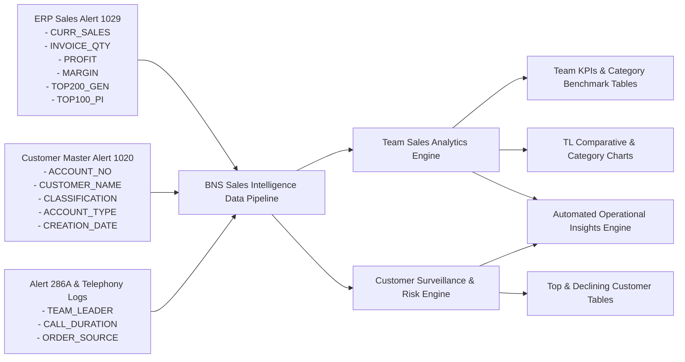

# Functional Specification: Team Sales Dashboard
**Document Version:** 1.0  
**Project:** BNS Sales Intelligence Platform  
**Module:** Telesales & Team Performance Analytics (Team Sales Dashboard)  
**Date:** August 2026  

---

## Document Control & Approvals

| Role | Name & Designation | Signature | Date |
| :--- | :--- | :--- | :--- |
| **Author** | **Amit Porwal**<br>IT - Business Analyst | ______________________________ | ____________ |
| **Reviewer** | **Amit Sanandiya**<br>IT – Project Manager | ______________________________ | ____________ |
| **Approver** | **Ajay Soin / Deepak Pariyani**<br>Sales Manager / Team Leader | ______________________________ | ____________ |

---

## 1. Introduction

The **Team Sales Dashboard** (also known as the **Team Lead - Telesales Performance Dashboard**) is an enterprise operational, managerial, and diagnostic business intelligence module engineered for **BNS Distribution** as an integral component of the **BNS Sales Intelligence Platform**. 

The primary objective of this module is to empower Telesales Team Leaders (TLs), the Telesales Manager, Commercial Operations Directors, and Sales Executives with comprehensive operational intelligence across three core operational dimensions:

1. **Telesales Team Performance & Target Attainment:** Real-time visibility into cumulative team sales revenue, gross margin contribution, physical box throughput volume, and monthly quota achievement percentages across all active telesales teams (Amit, Sanket, Sumit, Jaishali, Ayaz, Kam, Prashant, Deepak, Jagdish, and Steffi).
2. **Product Category Mix & 3-Month Benchmark Diagnostics:** Granular comparative analytics comparing current month sales against the previous 3-month rolling daily averages across major pharmaceutical categories (Generic, Ethical, Parallel Import [PI], Over-The-Counter [OTC], Controlled Drugs [CD], Perfumes, and Syri Sales), coupled with Year-over-Year (YoY 2025 vs. 2026) category variance tracking.
3. **Customer Account Surveillance & Risk Management:** Automated tracking and ranking of key revenue-driving accounts (**Top Performing Customers Table** with velocity metrics on Top 200 Generic lines and Top 100 PI lines) and urgent churn/attrition risk surveillance (**Bottom Performing Customers / Declining Accounts Table** with negative variance and decline percentage tracking).
4. **Automated Rule-Based Operational Insights:** Contextual intelligence engine providing dynamic alert notifications highlighting highest performing teams, underperforming teams requiring managerial intervention, rapid-growth product categories, margin leaders, and critical account churn risks.

---

## 2. Scope

### In-Scope
The scope of the Team Sales Dashboard encompasses the complete UI wireframe architecture, multi-dimensional filter logic, calculation engines, data source mapping (Alert 1029 ERP Sales Invoices, Alert 1020 Customer Master, Alert 286A Live Transaction Feeds, and Telesales Activity Logs), and interactive reporting interfaces for:

1. **Multi-Dimensional Filter Engine:**
   - Primary Header Filter: Single-select Team Leader selector (`filterTeam_page_team`).
   - Global Filter Bar: Date Range Selector with dynamic Custom Date Pickers (`filterDate_page_team`), Secondary Team Filter (`tlTeamFilter`), Product Category Filter, Customer Classification Filter (Class A–D), and Account Type Filter (Independent vs. Group).
2. **Executive KPI Engine:**
   - 4 executive KPI summary cards: Total Active Accounts, New Account Openings, Average Sales Benchmark Comparison (Previous 3-Month Rolling Average vs. Current Month Average), and Sales Revenue Difference / Total Sales Till Date.
   - Target Achievement Doughnut Gauge and linear progress bar with financial surplus/deficit tracking.
3. **Product Category & Benchmark Comparative Analytics:**
   - **Product Category Sales Table:** Matrix rows (Generic, Ethical, PI, OTC, CD, Perfumes, Total Sales, Syri Sales) comparing Current Month Performance against Previous 3-Month Rolling Averages with variance values and qualitative status badges (`● Better` / `● Below`).
   - **Core Matrix Sales Comparison Table:** Operational metrics (Sales Revenue, Boxes Sold, Gross Profit, Gross Margin %, Syri Sales) comparing Current Month against Previous 3-Month Average.
4. **Interactive Bar Charts & Visualizations:**
   - **TL Performance Analysis Bar Chart:** Grouped bar chart comparing Current Month Sales vs. Previous 3-Month Average across all 10 Team Leaders, featuring dynamic conditional color thresholding (Blue/Green for above average, Red for below average).
   - **Sales by Category Bar Chart (2025 vs. 2026):** Grouped/stacked bar chart illustrating Year-over-Year category performance.
   - **Category Sales Share % Distribution Bar Chart:** Visual breakdown of percentage contribution per product category.
5. **Customer Account Analytics & Segmentation Sub-Section:**
   - Account Portfolio Mini Badges (Total Active, Independent, Group Accounts, New This Month, Closed/Dormant).
   - 12-Month Rolling Account Growth Trend Bar Chart vs. Target Quota.
   - Customer Classification Distribution Bar Chart (Class A, Class B, Class C, Class D).
6. **Team Leaderboard Component:**
   - Comprehensive ranking card displaying team rank (Gold, Silver, Bronze badges), team leader avatar, target achievement percentage with dynamic progress bar, total sales, gross profit, box volume, and gross margin percentage.
7. **Customer Surveillance & Drill-Down Tables:**
   - **Bottom Performing Customers (Declining Accounts Table):** Filterable table identifying accounts with sharp turnover drop, displaying Previous Month Sales, Current Month Sales, Difference (£), Decline %, and Last Order Date.
   - **Top Performing Customers Table:** Ranked table displaying Customer Name, Unique Account Code, Assigned Team, Order Count, Top 200 Generic Lines purchased, Top 100 PI Lines purchased, Total Sales (£), Gross Profit (£), and Last Purchase Date.
8. **Automated AI/Rule-Based Operational Insights Engine:**
   - 8 dynamic contextual insight cards providing actionable operational intelligence on team performance, category growth, margin optimization, and account churn.
9. **Master Export & Extraction Sub-System:**
   - Client-side export capabilities (CSV, Excel HTML Blob, and formatted PDF print layouts).

### Out of Scope
- Direct order entry, cart modification, or sales order dispatching (handled by BNS ERP / Telesales Order Capture Systems).
- Direct modification of telephony PBX / VoIP call switching hardware.
- Real-time stock reservation overrides or warehouse bin relocations.
- ERP customer credit limit authorization (governed by Central Credit Control).

---

## 3. Abbreviations

| Abbreviation | Description |
| :--- | :--- |
| **TL** | Telesales Team Leader |
| **RSM** | Regional Sales Manager |
| **KPI** | Key Performance Indicator |
| **MTD** | Month to Date |
| **YTD** | Year to Date |
| **YoY** | Year over Year (e.g., August 2025 vs. August 2026) |
| **GM / Margin %** | Gross Margin Percentage: `(Gross Profit / Sales Revenue) * 100` |
| **COGS** | Cost of Goods Sold |
| **EDI** | Electronic Data Interchange |
| **PMR** | Pharmacy Management System (e.g., Dataplast, Cambrian, Cascade, PharmAssist) |
| **DT** | Drug Tariff Pharmaceutical Lines |
| **NDT** | Non-Drug Tariff Pharmaceutical Lines |
| **CD** | Controlled Drugs (Schedule 2–5) |
| **PI** | Parallel Import Products |
| **OTC** | Over-The-Counter Healthcare Products |
| **AOV** | Average Order Value: `Total Sales Revenue / Total Orders` |
| **CPO** | Calls Per Order / Cost Per Order |
| **BNS** | B&S Group Distribution |
| **FS** | Functional Specification |
| **DS** | Design Specification |

---

## 4. Dashboard Layout, Navigation & Filter Engine

### 4.1 UI Layout Architecture

The Team Sales Dashboard is architected with a modular, responsive grid layout structured into clean operational tiers:

```
+----------------------------------------------------------------------------------------------------+
|  Team Lead - Telesales Dashboard                                         [ Current Date: MTD ]     |
+----------------------------------------------------------------------------------------------------+
|  [HEADER FILTER BAR]                                                                               |
|  - Team Leader Selector (All Team Leaders, Amit, Sanket, Jaishali, Ayaz, Kam, Prashant...)         |
+----------------------------------------------------------------------------------------------------+
|  [EXECUTIVE KPI ROW - 4 CARDS]                                                                     |
|  [ Total Active Accounts ] [ New Account Opens ] [ Avg Sales (3M vs Curr) ] [ Sales Difference ]   |
+----------------------------------------------------------------------------------------------------+
|  [PRODUCT CATEGORY & BENCHMARK COMPARATIVE TABLES - 2 COLUMN GRID]                                 |
|  +--------------------------------------------+  +-----------------------------------------------+ |
|  | Product Category Sales Table               |  | Core Matrix Sales Comparison Table            | |
|  | (Current Month Avg vs Prev 3 Months Avg)   |  | (Sales, Boxes, Profit, Margin %, Syri Sales)  | |
|  +--------------------------------------------+  +-----------------------------------------------+ |
+----------------------------------------------------------------------------------------------------+
|  [TL PERFORMANCE ANALYSIS BAR CHART - FULL WIDTH]                                                  |
|  - Grouped Bar Chart: Current Month Sales vs. Prev 3-Month Average per Team Leader                |
|  - Dynamic Threshold Colors: Blue (Above Avg) | Red (Below Avg)                                    |
+----------------------------------------------------------------------------------------------------+
|  [GLOBAL SECONDARY FILTER BAR]                                                                     |
|  - Date Range (Current Month, Prev Month, Custom Date) | Team Filter | Category | Class | Acct Type|
+----------------------------------------------------------------------------------------------------+
|  [CUSTOMER SURVEILLANCE & DRILL-DOWN TABLES]                                                       |
|  +-----------------------------------------------------------------------------------------------+ |
|  | Bottom Performing Customers — Declining Accounts (Search, Prev, Curr, Diff, Decline %, Date) | |
|  +-----------------------------------------------------------------------------------------------+ |
|  +-----------------------------------------------------------------------------------------------+ |
|  | Top Performing Customers Table (Search, Rank Medals, Acct, Team, Top 200, Top 100, Sales, GP) | |
|  +-----------------------------------------------------------------------------------------------+ |
+----------------------------------------------------------------------------------------------------+
|  [AUTOMATED TEAM PERFORMANCE INSIGHTS ENGINE - 8 ALERT CARDS]                                      |
|  - Highest Performing Team | Teams Below Target | Fastest Growing Category | Declining Accounts    |
|  - Above 3-Month Average  | New Account Growth | Category Alerts          | Margin Optimization   |
+----------------------------------------------------------------------------------------------------+
```

---

### 4.2 Filter Engine Specifications

The Team Sales Dashboard features two coordinated filter control sets:

#### Filter Set 1: Header Primary Filter

| Filter Field | UI Element | Control ID | Options / Values | Logic & Behavior |
| :--- | :--- | :--- | :--- | :--- |
| **Team Leader Selector** | Single Select Dropdown | `#filterTeam_page_team` | - All Team Leaders (Default)<br>- Amit<br>- Sanket<br>- Jaishali<br>- Ayaz<br>- Kam<br>- Prashant | Slices all dashboard KPI cards, category benchmark tables, TL comparison bar chart, and customer drill-down tables to the selected Team Leader's account portfolio. |

---

#### Filter Set 2: Global Secondary Multi-Dimensional Filter Bar

| Filter Field | UI Element | Control ID | Options / Values | Logic & Behavior |
| :--- | :--- | :--- | :--- | :--- |
| **Date Range Filter** | Single Select Dropdown + Dynamic Date Inputs | `#filterDate_page_team` | - Current month (Default)<br>- Previous Month<br>- Custome Date (`value="custom"`) | Controls the active evaluation time window. Selecting **Custome Date** dynamically unhides two HTML5 date pickers (`#customDateFrom_page_team` and `#customDateTo_page_team`). |
| **Telesales Team** | Single Select Dropdown | `#tlTeamFilter` | - 👥 All Teams (Default)<br>- Amit Team<br>- Sanket Team<br>- Jaishali Team<br>- Ayaz Team<br>- Kam Team<br>- Prashant Team | Slices dataset by telesales operational pod/team. Synchronizes bidirectionally with header team filter. |
| **Product Category** | Single Select Dropdown | `#filterCategory_page_team` | - All Categories (Default)<br>- Generic<br>- PI<br>- Ethical<br>- OTC<br>- CD<br>- Perfumes | Filters category sales comparisons and limits customer purchase metrics to selected product category. |
| **Customer Classification** | Single Select Dropdown | `#filterClass_page_team` | - All Classifications (Default)<br>- Class A (£5K+ / month)<br>- Class B (£2K - £5K / month)<br>- Class C (£500 - £2K / month)<br>- Class D (< £500 / month) | Slices customer portfolio and ranking tables according to customer spending tier. |
| **Account Type** | Single Select Dropdown | `#filterAcctType_page_team` | - Independent & Group (Default)<br>- Independent<br>- Group Account | Filters between independent standalone pharmacies and multi-branch retail pharmacy buying groups. |

---

## 5. Functional Requirements — Executive KPIs, Comparison Tables & Charts

### 5.1 Executive Performance KPI Cards

| Component ID | **TEAM-KPI-01** |
| :--- | :--- |
| **Component Name** | Executive Performance KPI Cards |
| **Priority** | High |
| **Target Role** | Telesales Team Leader, Telesales Manager, Commercial Operations Director |
| **Purpose** | Immediate high-level snapshot of active customer base, new customer acquisition, 3-month benchmark sales comparison, and cumulative revenue variance. |

| Metric Name | Type | Display Value & Format | Calculation Logic & Data Source | Visual Rules & Styling |
| :--- | :--- | :--- | :--- | :--- |
| **Total Active Accounts** | KPI Card | Formatted Integer (e.g., `5,842`) | `COUNT(DISTINCT Account_No)` with $\ge 1$ invoiced transaction in current active period.<br>**Source:** Alert 1029 / Customer Master Alert 1020. | Primary Blue theme (`--primary` / `.kpi-card.blue`). |
| **New Account Opens** | Composite KPI Card | Formatted Integer (e.g., `142`) | `COUNT(DISTINCT Account_No WHERE Creation_Date = Current_Month)`<br>**Source:** Customer Master Alert 1020. | Emerald Green theme (`--success` / `.kpi-card.green`). |
| **Avg Sales (Prev 3M vs Curr)** | Comparative KPI Card | Currency Comparison (e.g., `£4.86M vs £5.45M`) | `Prev_3M_Avg = SUM(Sales_M-1 + Sales_M-2 + Sales_M-3) / 3`<br>`Curr_Month_Sales = Total MTD Ingested Revenue`<br>**Source:** Alert 1029. | Cyan theme (`--cyan` / `.kpi-card.cyan`). Shows baseline vs. active revenue. |
| **Sales Difference** | KPI Card | Currency Variance with sign (e.g., `+£590K`) | `Sales_Difference = Curr_Month_Sales - Prev_3M_Avg`<br>**Source:** Alert 1029. | Purple theme (`--purple` / `.kpi-card.purple`). Displays `+` prefix in green/purple for positive growth, `-` in red for decline. |

---

### 5.2 Product Category Sales Performance Table

| Component ID | **TEAM-TBL-01** |
| :--- | :--- |
| **Component Name** | Product Category Sales Table (Current Month Avg vs. Prev 3 Months Avg) |
| **HTML Container ID** | `#teamCatTable` |
| **Priority** | High |
| **Purpose** | Evaluates category-level revenue momentum against 3-month rolling baselines to identify outperforming and lagging product lines. |

| Column Name | Type | Data / Calculation Logic | Formatting & Visual Rules |
| :--- | :--- | :--- | :--- |
| **Matrix** | Text Column | Product Category Classification:<br>1. Generic<br>2. Ethical<br>3. PI (Parallel Import)<br>4. OTC (Over-The-Counter)<br>5. CD (Controlled Drugs)<br>6. Perfumes<br>7. **Total Sales**<br>8. **Syri Sales** | Standard bold text for category names; highlighted styling for summary rows (**Total Sales**, **Syri Sales**). |
| **3 Month Average** | Currency Column | `SUM(Sales_M-1 + Sales_M-2 + Sales_M-3) / 3` per category.<br>**Source:** Alert 1029 historical sales records. | Right-aligned formatted currency (`£X.XXM` or `£XXXK`). |
| **Current month Average** | Currency Column | `Total_Category_Sales_MTD`<br>**Source:** Alert 1029 `CURR_SALES`. | Right-aligned formatted currency (`£X.XXM` or `£XXXK`). |
| **Difference** | Currency Variance Column | `Difference = Current_Month_Sales - 3_Month_Average` | If `Difference >= 0`: Green text (`text-success`, `+£XXXK`).<br>If `Difference < 0`: Red text (`text-danger`, `-£XXK`). |
| **Status** | Status Badge Column | Qualitative performance indicator derived from `Difference`. | If `Difference >= 0`: Green status dot (`●`) + `"Better"`.<br>If `Difference < 0`: Red status dot (`●`) + `"Below"`. |

#### Baseline Category Benchmark Values:

| Matrix Row | 3 Month Average | Current Month Average | Difference | Status Indicator |
| :--- | :---: | :---: | :---: | :---: |
| **Generic** | £2.66M | £2.78M | +£120K | `● Better` (Green) |
| **Ethical** | £790K | £802K | +£12K | `● Better` (Green) |
| **PI** | £448K | £468K | +£20K | `● Better` (Green) |
| **OTC** | £649K | £664K | +£15K | `● Better` (Green) |
| **CD** | £382K | £372K | -£10K | `● Below` (Red) |
| **Perfumes** | £357K | £362K | +£5K | `● Better` (Green) |
| **Total Sales** | **£4.86M** | **£5.45M** | **+£590K** | **`● Better` (Green)** |
| **Syri Sales** | **£1.20M** | **£1.22M** | **+£0.20M** | **`● Better` (Green)** |

---

### 5.3 Core Matrix Sales Comparison Table

| Component ID | **TEAM-TBL-02** |
| :--- | :--- |
| **Component Name** | Sales Comparison Table (Current Month vs. Avg of Prev 3 Months) |
| **HTML Container ID** | `#teamCompTable` |
| **Priority** | High |
| **Purpose** | Evaluates overall operational throughput including total revenue, physical unit/box volume, gross profit, gross margin percentage, and specialized Syri sales. |

| Metric (Matrix) | Previous 3-Month Avg | Current Month Value | Difference Formula | Visual Indicator Rule |
| :--- | :---: | :---: | :---: | :--- |
| **Sales** | £4.86M | £5.45M | `+£590K` | `● Better` (Green dot + bold green text) |
| **Boxes Sold** | 212K | 241K | `+29K` | `● Better` (Green dot + bold green text) |
| **Gross Profit** | £952K | £1.09M | `+£138K` | `● Better` (Green dot + bold green text) |
| **Gross Margin** | 19.6% | 20.0% | `+0.4pp` | `● Better` (Green dot + bold green text) |
| **Syri Sales** | £1.20M | £1.22M | `+£0.20M` | `● Better` (Green dot + bold green text) |

---

### 5.4 Team Leader (TL) Performance Analysis Bar Chart

| Component ID | **TEAM-CHT-01** |
| :--- | :--- |
| **Component Name** | TL Performance Analysis — Current Month vs. 3 Month Average |
| **HTML Canvas ID** | `#teamCompChart` |
| **Priority** | High |
| **Chart Type** | Grouped Bar Chart (Chart.js) with Dynamic Conditional Formatting |
| **Purpose** | Side-by-side comparative benchmarking of each Telesales Team Leader's active monthly revenue generation against their historical 3-month rolling benchmark. |

#### Chart Configuration & Dataset Specifications:

| Axis / Layer | Property / Label | Color Code / Styling | Description & Logic |
| :--- | :--- | :--- | :--- |
| **X-Axis** | Team Leader Names | Discrete Categorical Labels | `['Amit', 'Sanket', 'Sumit', 'Jaishali', 'Ayaz', 'Kam', 'Prashant', 'Deepak', 'Jagdish', 'Steffi']` |
| **Y-Axis** | Sales Revenue (£K) | Formatted Currency Axis | Dynamic linear scale (`0` to `£1,400K`). |
| **Dataset 1** | **Avg Prev 3 Months** | `#94a3b8` (Slate Grey Bar) | Represents the baseline 3-month average sales for each team leader. |
| **Dataset 2** | **Current Month** | **Dynamic Threshold:**<br>- `#1a56db` (Blue) if `Current >= 3M Avg`<br>- `#ef4444` (Crimson Red) if `Current < 3M Avg` | Ingests active MTD sales revenue. Bars failing to meet the historical baseline are automatically flagged in red. |

#### Team Performance Benchmark Matrix:

| Team Leader | Prev 3M Avg (£K) | Current Month (£K) | Difference (£K) | Variance % | Bar Color Flag |
| :--- | :---: | :---: | :---: | :---: | :---: |
| **Amit** | £1,148 | £1,280 | +£132K | +11.5% | Blue (`#1a56db`) |
| **Sanket** | £982 | £1,080 | +£98K | +10.0% | Blue (`#1a56db`) |
| **Sumit** | £940 | £1,020 | +£80K | +8.5% | Blue (`#1a56db`) |
| **Jaishali** | £968 | £942 | -£26K | -2.7% | **Red (`#ef4444`)** |
| **Ayaz** | £788 | £820 | +£32K | +4.1% | Blue (`#1a56db`) |
| **Kam** | £724 | £742 | +£18K | +2.5% | Blue (`#1a56db`) |
| **Prashant** | £634 | £612 | -£22K | -3.5% | **Red (`#ef4444`)** |
| **Deepak** | £600 | £580 | -£20K | -3.3% | **Red (`#ef4444`)** |
| **Jagdish** | £540 | £520 | -£20K | -3.7% | **Red (`#ef4444`)** |
| **Steffi** | £510 | £480 | -£30K | -5.9% | **Red (`#ef4444`)** |

---

### 5.5 Sales by Category Bar Chart (2025 vs. 2026 Comparison)

| Component ID | **TEAM-CHT-02** |
| :--- | :--- |
| **Component Name** | Sales by Category — 2026 vs 2025 Comparison Bar Chart |
| **HTML Canvas ID** | `#teamCatBarChart` |
| **Priority** | Medium |
| **Chart Type** | Grouped Bar Chart (Chart.js) |
| **Purpose** | Compares Year-over-Year (YoY) revenue generated in each pharmaceutical product category between current year (2026) and prior year (2025). |

| Product Category | 2025 Sales (£K) (`#94a3b8`) | 2026 Sales (£K) (`#1a56db`) | YoY Variance (£K) | YoY Growth % |
| :--- | :---: | :---: | :---: | :---: |
| **Generic** | £2,562 | £2,780 | +£218K | +8.5% |
| **PI** | £438 | £468 | +£30K | +6.8% |
| **Ethical** | £768 | £802 | +£34K | +4.4% |
| **OTC** | £588 | £664 | +£76K | +12.9% |
| **CD** | £380 | £372 | -£8K | -2.1% |
| **Perfumes** | £312 | £362 | +£50K | +16.0% |

---

### 5.6 Category Sales Share % Distribution Bar Chart

| Component ID | **TEAM-CHT-03** |
| :--- | :--- |
| **Component Name** | Category Sales Distribution Share % |
| **HTML Canvas ID** | `#teamCatShareChart` |
| **Priority** | Medium |
| **Chart Type** | Multi-colored Horizontal/Vertical Bar Chart |
| **Purpose** | Displays percentage contribution of each product category to total sales turnover. |

| Product Category | Share % | Palette Hex Code | Description |
| :--- | :---: | :--- | :--- |
| **Generic** | **51.0%** | `#1a56db` (Primary Blue) | Core volume and revenue driver of telesales. |
| **Ethical** | **14.7%** | `#8b5cf6` (Purple) | High-value branded pharmaceutical lines. |
| **OTC** | **12.2%** | `#10b981` (Emerald Green) | Over-the-counter retail pharmacy products. |
| **PI** | **8.6%** | `#f59e0b` (Amber) | Parallel imported ethical and generic lines. |
| **CD** | **6.8%** | `#ef4444` (Crimson Red) | Regulated Controlled Drugs Schedule 2–5. |
| **Perfumes** | **6.7%** | `#06b6d4` (Cyan) | High-margin cosmetic and fragrance lines. |

---

### 5.7 Target Achievement Gauge & Progress Indicator

| Component ID | **TEAM-GGE-01** |
| :--- | :--- |
| **Component Name** | Team Target Achievement Gauge & Status Card |
| **HTML Canvas ID** | `#teamGaugeChart` |
| **Priority** | Medium |
| **Chart Type** | Semi-Doughnut / Doughnut Gauge (Cutout: 75%) + Dynamic Center Text |
| **Formula** | `Target_Attainment_% = (Total_Achieved_Sales / Monthly_Sales_Target) * 100` |
| **Display Metrics** | - Monthly Target: **£5.30M**<br>- Total Achieved: **£5.45M**<br>- Surplus Above Target: **+£150K**<br>- Attainment Rate: **102.8%** (`#10b981` Success Theme) |

---

## 6. Functional Requirements — Customer Surveillance, Leaderboard & Insights

### 6.1 Customer Account Analytics Sub-Section

#### 1. Account Portfolio Mini Badges (`#teamAcctMini`)
- **Total Active Accounts:** `5,842` (Invoiced accounts with purchasing activity)
- **Independent Accounts:** `4,108` (Standalone single-branch community pharmacies)
- **Group Accounts:** `1,734` (Multi-branch pharmacy groups and regional chains)
- **New This Month:** `142` (New customer trading accounts opened in current month)
- **Closed / Dormant Accounts:** `48` (Zero billing in past 90 days or marked closed)

#### 2. Account Growth Trend vs. Target (`#teamAcctGrowthChart`)
- **Chart Type:** Grouped Bar Chart across 12 rolling months.
- **Dataset 1 (Total Active Accounts):** Blue bars (`#1a56db`), tracking total active account volume expansion (e.g., 5,600 to 5,842).
- **Dataset 2 (New Accounts Opened):** Emerald Green bars (`#10b981`), displaying monthly new account acquisitions (e.g., 110 to 142/month).

#### 3. Account Classification Distribution (`#teamAcctClassChart`)
- **Chart Type:** Multi-colored Bar Chart segmenting accounts by monthly spend tier:
  - **Class A (£5K+ / month):** 1,284 accounts (`#1a56db` Primary Blue) — High-volume priority spenders.
  - **Class B (£2K - £5K / month):** 2,120 accounts (`#10b981` Emerald Green) — Mid-high core commercial accounts.
  - **Class C (£500 - £2K / month):** 1,680 accounts (`#f59e0b` Amber) — Standard community pharmacies.
  - **Class D (< £500 / month):** 758 accounts (`#ef4444` Crimson Red) — Low-velocity or ad-hoc purchasing accounts.

---

### 6.2 Team Leaderboard Component

| Component ID | **TEAM-TBL-03** |
| :--- | :--- |
| **Component Name** | Telesales Team Leaderboard |
| **HTML Container ID** | `#teamLeaderboard` |
| **Priority** | High |
| **Purpose** | Ranks telesales teams based on total revenue, gross profit, physical box throughput, gross margin %, and monthly quota attainment. |

| Field / UI Element | Type | Logic & Display Rule |
| :--- | :--- | :--- |
| **Rank Badge** | Badge / Icon | - Rank 1: Gold Badge (`.rank-1`, `🥇`)<br>- Rank 2: Silver Badge (`.rank-2`, `🥈`)<br>- Rank 3: Bronze Badge (`.rank-3`, `🥉`)<br>- Rank 4+: Neutral numerical badge (`4`, `5`, `6`...) |
| **Team Leader Avatar** | Circular Avatar | First initial of Team Leader with dedicated team brand color background. |
| **Team Name & Role** | Text Stack | **Line 1:** `{TL} Team` (e.g., `Amit Team`, `Sanket Team`).<br>**Line 2:** `Team Leader: {TL}`. |
| **Target Progress Bar** | Dynamic Progress Bar | Visual fill width representing target achievement % (`Math.min(Target_Pct, 100)%`).<br>- **Green (`success`):** If `Target_Pct >= 100%`<br>- **Amber (`warning`):** If `90% <= Target_Pct < 100%`<br>- **Red (`danger`):** If `Target_Pct < 90%` |
| **Sales** | Currency Metric | Total team sales revenue MTD (`£X.XXM` or `£XXXK`). |
| **Profit** | Currency Metric | Cumulative Gross Profit generated MTD (`£XXXK`). |
| **Boxes** | Integer Metric | Total physical carton/box volume dispatched (`X,XXX`). |
| **Margin %** | Percentage Metric | Team gross profit margin (`XX.X%`). |
| **Target % Badge** | Status Badge | Pill badge color-coded matching progress bar status (e.g., `114%`, `106%`, `83%`). |

#### Master Leaderboard Data Matrix:

| Rank | Team Leader | Sales (£) | Gross Profit (£) | Boxes Sold | Margin % | Target % | Status Class |
| :---: | :--- | :---: | :---: | :---: | :---: | :---: | :--- |
| **1** | **Amit Team** | £1.28M | £256K | 3,648 | 20.1% | **114%** | `badge-success` |
| **2** | **Sanket Team** | £1.08M | £212K | 3,072 | 19.6% | **106%** | `badge-success` |
| **3** | **Sumit Team** | £1.02M | £198K | 2,850 | 19.4% | **102%** | `badge-success` |
| **4** | **Jaishali Team** | £942K | £200K | 2,680 | 21.2% | **98%** | `badge-warning` |
| **5** | **Ayaz Team** | £820K | £156K | 2,333 | 19.0% | **94%** | `badge-warning` |
| **6** | **Kam Team** | £742K | £141K | 2,112 | 19.0% | **91%** | `badge-warning` |
| **7** | **Prashant Team** | £612K | £110K | 1,741 | 17.9% | **83%** | `badge-danger` |
| **8** | **Deepak Team** | £580K | £102K | 1,650 | 17.5% | **79%** | `badge-danger` |
| **9** | **Jagdish Team** | £520K | £94K | 1,480 | 18.0% | **75%** | `badge-danger` |
| **10** | **Steffi Team** | £480K | £88K | 1,350 | 18.3% | **71%** | `badge-danger` |

---

### 6.3 Customer Surveillance: Bottom Performing Customers (Declining Accounts)

| Component ID | **TEAM-TBL-04** |
| :--- | :--- |
| **Component Name** | Bottom Performing Customers — Declining Accounts Table |
| **HTML Container ID** | `#teamDecliningTable` |
| **Search Input ID** | `#teamBotSearch` (Live client-side filter by Customer Name or Assigned Team) |
| **Priority** | High |
| **Purpose** | Proactive churn surveillance table identifying high-revenue accounts that have experienced severe sales drops compared to the prior month, mandating immediate Team Leader and Telesales Executive outreach. |

| Column | Data Type | Calculation / Data Field | Visual Display & Rules |
| :--- | :--- | :--- | :--- |
| **Customer Name** | Text Column | Legal trading name of the pharmacy. | Bold text (`font-semibold`). |
| **Team** | Badge Column | Telesales Team Leader assigned to account. | Purple badge (`badge-purple`). |
| **Prev Month Sales** | Currency Column | Total invoiced sales revenue in previous month ($M-1$). | Right-aligned formatted currency (`£XX,XXX`). |
| **Current Month Sales** | Currency Column | Total invoiced sales revenue MTD ($M$). | Right-aligned formatted currency (`£XX,XXX`). |
| **Difference** | Currency Variance Column | `Difference = Current_Month_Sales - Prev_Month_Sales` | Bold red text (`text-danger font-semibold`, `-£X,XXX`). |
| **Decline %** | Percentage Badge Column | `Decline % = ((Current_Sales - Prev_Sales) / Prev_Sales) * 100` | Crimson Red Badge (`badge-danger`, e.g., `-34.4%`). |
| **Last Order Date** | Date Column | Timestamp of most recent invoiced order. | Subtle text styling (`color: var(--text2); font-size: 12px;`). |

#### Reference Declining Accounts Surveillance Data:

| Customer Name | Team | Prev Month Sales | Current Month Sales | Difference (£) | Decline % | Last Order Date |
| :--- | :---: | :---: | :---: | :---: | :---: | :---: |
| **Maple Pharmacy** | Prashant | £12,840 | £8,420 | -£4,420 | `-34.4%` | 02 Jul 2026 |
| **QuickCure Ltd** | Kam | £9,180 | £6,240 | -£2,940 | `-32.0%` | 28 Jun 2026 |
| **GreenLeaf Dispensary** | Ayaz | £7,640 | £5,380 | -£2,260 | `-29.6%` | 05 Jul 2026 |
| **Central Care Chemist** | Jaishali | £11,200 | £8,120 | -£3,080 | `-27.5%` | 10 Jul 2026 |
| **Harmony Health** | Sanket | £6,840 | £5,020 | -£1,820 | `-26.6%` | 01 Jul 2026 |

---

### 6.4 Customer Surveillance: Top Performing Customers Table

| Component ID | **TEAM-TBL-05** |
| :--- | :--- |
| **Component Name** | Top Performing Customers Table |
| **HTML Container ID** | `#teamTopTable` |
| **Search Input ID** | `#teamTopSearch` (Live client-side filter by Customer Name or Assigned Team) |
| **Priority** | High |
| **Purpose** | Highlights leading revenue-generating accounts across the territory to evaluate key account retention, order frequency, gross profit contribution, and cross-selling penetration across Top 200 Generic and Top 100 PI lines. |

| Column | Data Type | Description / Logic | Visual Display & Rules |
| :--- | :--- | :--- | :--- |
| **Rank** | Badge / Number | Ordinal sales ranking position. | Top 3 display medals (`🥇`, `🥈`, `🥉`), subsequent ranks display numeric badge (`4`, `5`...). |
| **Customer Name** | Text Column | Registered pharmacy trading name. | Bold font (`font-semibold`). |
| **Acct No.** | Code Badge | Unique ERP Account code (e.g., `ACC-1042`). | Primary blue badge (`badge-primary`). |
| **Team** | Badge Column | Assigned Telesales Team. | Purple badge (`badge-purple`). |
| **Orders** | Integer Column | Total invoiced order transactions MTD. | Right-aligned integer (`td-num`). |
| **Top 200 Line** | Integer Column | Count of high-velocity top 200 Generic SKUs purchased. | Right-aligned integer (`td-num`). |
| **Top 100 PI** | Integer Column | Count of top 100 Parallel Import SKUs purchased. | Right-aligned integer (`td-num`). |
| **Total Sales** | Currency Column | Cumulative revenue generated MTD. | Bold right-aligned currency (`td-num font-bold`, `£XX,XXX`). |
| **Gross Profit** | Currency Column | Cumulative gross profit generated MTD. | Right-aligned currency (`td-num`, `£XX,XXX`). |
| **Last Purchase** | Date Column | Date of most recent invoiced order. | Standard date format (`DD MMM YYYY`, `color: var(--text2)`). |

#### Reference Top Performing Customers Master Data:

| Rank | Customer Name | Acct No. | Team | Orders | Top 200 Line | Top 100 PI | Total Sales | Gross Profit | Last Purchase |
| :---: | :--- | :---: | :---: | :---: | :---: | :---: | :---: | :---: | :---: |
| 🥇 | **City Pharmacy Ltd** | `ACC-1042` | Amit | 124 | 25 | 15 | £42,840 | £8,568 | 18 Jul 2026 |
| 🥈 | **Wellbeing Dispensary** | `ACC-0881` | Sanket | 108 | 22 | 12 | £38,420 | £7,684 | 19 Jul 2026 |
| 🥉 | **MediCare Plus** | `ACC-1124` | Amit | 98 | 20 | 10 | £35,180 | £7,036 | 17 Jul 2026 |
| **4** | **HealthFirst Chemist** | `ACC-0764` | Jaishali | 88 | 18 | 9 | £31,640 | £6,328 | 16 Jul 2026 |
| **5** | **Central Pharmacy Group** | `ACC-0543` | Ayaz | 82 | 16 | 8 | £28,920 | £5,784 | 20 Jul 2026 |
| **6** | **Sunrise Medical** | `ACC-1302` | Sanket | 76 | 15 | 7 | £26,480 | £5,296 | 15 Jul 2026 |
| **7** | **BrightHealth Pharma** | `ACC-0921` | Kam | 70 | 14 | 7 | £24,180 | £4,836 | 14 Jul 2026 |
| **8** | **Pinnacle Chemists** | `ACC-1088` | Prashant | 64 | 12 | 6 | £21,840 | £4,368 | 19 Jul 2026 |
| **9** | **Valley Healthcare** | `ACC-0672` | Jaishali | 58 | 11 | 5 | £19,420 | £3,884 | 13 Jul 2026 |
| **10** | **North Star Pharmacy** | `ACC-1214` | Amit | 52 | 10 | 5 | £17,280 | £3,456 | 18 Jul 2026 |

---

### 6.5 Automated AI/Rule-Based Operational Insights Engine

| Component ID | **TEAM-INS-01** |
| :--- | :--- |
| **Component Name** | Automated Team Performance Insights Grid |
| **HTML Container ID** | `#teamInsights` |
| **Priority** | High |
| **Purpose** | Evaluates active sales and pipeline data against business logic rules to render dynamic actionable insight cards with dismissal controls. |

The system evaluates the active dataset dynamically and renders 8 automated insight alert cards:

```
+---------------------------------------------------------------------------------------------------+
| 🏆 Highest Performing Team                                                                        |
|    Amit Team leads with £1.28M in monthly sales at 114% of target. Strong Generic product mix     |
|    and highest new account acquisition rate this month.                                           |
+---------------------------------------------------------------------------------------------------+
| ⚠️ Teams Below Target                                                                              |
|    Jaishali Team (98%), Ayaz Team (94%), Kam Team (91%) and Prashant Team (83%) are currently    |
|    below their monthly targets. Management review recommended.                                    |
+---------------------------------------------------------------------------------------------------+
| 🚀 Fastest Growing Category                                                                       |
|    Perfumes category is growing at +16.4% across all teams, driven by new product listings.      |
|    OTC is also performing strongly at +13.2%.                                                     |
+---------------------------------------------------------------------------------------------------+
| 📉 Accounts Requiring Attention                                                                   |
|    5 accounts show significant decline across teams. Maple Pharmacy (Prashant Team) has dropped   |
|    -34.4%. Immediate TL follow-up recommended.                                                    |
+---------------------------------------------------------------------------------------------------+
| 📊 Above 3-Month Average                                                                          |
|    Total team sales of £5.45M is £590K above the previous 3-month average of £4.86M — a +12.1%   |
|    improvement across all 6 teams.                                                                |
+---------------------------------------------------------------------------------------------------+
| 👥 New Account Acquisition                                                                        |
|    142 new accounts opened this month — the highest in 6 months. Amit Team leads with 38 new      |
|    accounts, followed by Sanket Team with 28.                                                     |
+---------------------------------------------------------------------------------------------------+
| 📦 Category Performance Alert                                                                     |
|    CD products have declined -1.8% to £372K across all teams. Recommend targeted product training |
|    and promotional activity for CD range.                                                         |
+---------------------------------------------------------------------------------------------------+
| 💡 Margin Improvement                                                                             |
|    Jaishali Team maintains the highest gross margin at 21.2% — above the company average of 20.0%.|
|    Best-practice sharing recommended across teams.                                                |
+---------------------------------------------------------------------------------------------------+
```

#### Automated Rule Definitions & Alert Triggers:

| Insight Type | Icon | Theme Class | Trigger Condition & Rule Logic |
| :--- | :---: | :--- | :--- |
| **Highest Performing Team** | 🏆 | `insight-success` | Identifies team with highest `Sales_Revenue` and `Target_Attainment_% > 100%`. |
| **Teams Below Target** | ⚠️ | `insight-warning` | Aggregates all teams where `Target_Attainment_% < 100%`. |
| **Fastest Growing Category** | 🚀 | `insight-success` | Evaluates category with highest positive YoY variance percentage. |
| **Declining Accounts Alert** | 📉 | `insight-danger` | Evaluates accounts where `Decline_% <= -25%` and `Prev_Sales >= £5,000`. |
| **Above 3M Average** | 📊 | `insight-cyan` | Triggers when total company sales `Current_Sales > Prev_3M_Avg`. |
| **New Account Acquisition** | 👥 | `insight-purple` | Evaluates total new customer count and ranks top recruiting team. |
| **Category Performance Alert** | 📦 | `insight-warning` | Triggers when any product category exhibits negative variance (`Difference < 0`). |
| **Margin Improvement** | 💡 | `insight-success` | Highlights team achieving highest `Gross_Margin_%` above overall company average. |

---

### 6.6 Multi-Format Data Export Sub-System

| Component ID | **TEAM-EXP-01** |
| :--- | :--- |
| **Component Name** | Client-Side Multi-Format Export Engine |
| **Priority** | High |
| **Supported Formats** | CSV (`.csv`), Excel HTML Blob (`.xls`), Formatted PDF Print Layout (`.pdf`) |

| Export Functionality | Output File Format | Data Scope & Filter State | Implementation Logic |
| :--- | :---: | :--- | :--- |
| **Export Team Performance** | `.csv` | Full aggregated team leaderboard data with sales, margin, and quota attainment. | `data:text/csv;charset=utf-8` URI string generation. |
| **Export Category Matrix** | `.xls` | Product Category Sales Table + Core Matrix Sales Comparison Table. | XML/HTML Table Blob (`application/vnd.ms-excel`). |
| **Export Top Customers** | `.csv` | Full list of top performing customer accounts with SKU velocity metrics. | Filtered client-side dataset converted to RFC 4180 CSV. |
| **Export Declining Accounts** | `.csv` / `.xls` | Critical list of declining customer accounts with decline percentages for immediate sales outreach. | Filtered declining account records with formatted negative variance. |
| **Print Executive Summary** | `.pdf` | High-level executive summary including KPI cards, charts, and summary tables. | Opens clean popup window with `@media print` CSS rules and executes `window.print()`. |

---

## 7. Business Rules, Calculations & Data Source Mapping

### 7.1 Data Pipeline & Ingestion Architecture



---

### 7.2 Mathematical Calculation Specifications

#### 1. Gross Margin Percentage (GM %):
$$\text{GM \%} = \left( \frac{\text{Gross Profit}}{\text{Sales Revenue}} \right) \times 100$$

#### 2. Rolling 3-Month Benchmark Daily Average:
$$\text{3M Daily Avg Sales} = \frac{\text{Sales}_{M-1} + \text{Sales}_{M-2} + \text{Sales}_{M-3}}{\text{Working Days}_{M-1} + \text{Working Days}_{M-2} + \text{Working Days}_{M-3}}$$

#### 3. Current Month Daily Sales Benchmark:
$$\text{Current Month Daily Avg Sales} = \frac{\text{Total Ingested Sales MTD}}{\text{BNS Elapsed Working Days MTD}}$$

#### 4. BNS Statutory Working Days Formulation:
$$\text{BNS Working Days} = \text{Total Calendar Days} - (\text{Saturdays} + \text{Sundays} + \text{UK Statutory Bank Holidays})$$

#### 5. Target Quota Attainment Percentage:
$$\text{Target Attainment \%} = \left( \frac{\text{Actual Sales Revenue MTD}}{\text{Monthly Assigned Target Quota}} \right) \times 100$$

#### 6. Customer Account Decline Percentage:
$$\text{Customer Decline \%} = \left( \frac{\text{Current Month Sales} - \text{Previous Month Sales}}{\text{Previous Month Sales}} \right) \times 100$$

#### 7. Year-over-Year (YoY) Sales Variance Percentage:
$$\text{YoY Variance \%} = \left( \frac{\text{Sales}_{2026} - \text{Sales}_{2025}}{\text{Sales}_{2025}} \right) \times 100$$

#### 8. Category Revenue Contribution Share Percentage:
$$\text{Category Share \%} = \left( \frac{\text{Total Category Sales Revenue}}{\text{Total Aggregate Sales Revenue}} \right) \times 100$$

---

### 7.3 Data Field Mapping Dictionary

| Target UI Element | UI Display Label | Source Table / Stream | Source Field Name | Transformation / Calculation Rule |
| :--- | :--- | :--- | :--- | :--- |
| **TEAM-KPI-01** | Total Active Accounts | Customer Master / Alert 1029 | `ACCOUNT_NO` | `COUNT(DISTINCT ACCOUNT_NO)` with sales in active period |
| **TEAM-KPI-02** | New Account Opens | Customer Master | `CREATION_DATE` | `COUNT(DISTINCT ACCOUNT_NO)` where `CREATION_DATE = Current_Month` |
| **TEAM-KPI-03** | Avg Sales (3M vs Curr) | Alert 1029 Invoices | `CURR_SALES`, `PREV_SALES` | Compare `AVG(Sales_M-1..M-3)` against `SUM(CURR_SALES)` |
| **TEAM-KPI-04** | Sales Difference | Alert 1029 Invoices | `CURR_SALES`, `PREV_SALES` | `SUM(CURR_SALES) - Prev_3M_Avg` |
| **TEAM-TBL-01** | Category Sales & Avg | Alert 1029 Invoices | `PRODUCT_CATEGORY`, `CURR_SALES` | Aggregated sum by product category classification |
| **TEAM-TBL-02** | Boxes Sold | Alert 1029 Invoices | `INVOICE_QTY` | `SUM(INVOICE_QTY)` converted to thousands (`K`) |
| **TEAM-TBL-02** | Gross Profit & Margin | Alert 1029 Invoices | `PROFIT`, `CURR_SALES` | `SUM(PROFIT)` and `(SUM(PROFIT)/SUM(CURR_SALES))*100` |
| **TEAM-CHT-01** | TL Comparison Bar | Alert 1029 / Master | `TEAM_LEADER`, `CURR_SALES` | Group by TL; color `#ef4444` if `CURR_SALES < PREV_3M_AVG` |
| **TEAM-TBL-03** | Team Leaderboard | Alert 1029 Invoices | `TEAM_LEADER`, `CURR_SALES`, `TARGET` | Rank by `CURR_SALES`; calculate `Target_%` |
| **TEAM-TBL-04** | Declining Accounts | Alert 1029 Invoices | `CUSTOMER_NAME`, `CURR_SALES`, `PREV_SALES` | Filter `((CURR_SALES - PREV_SALES)/PREV_SALES) < 0`; sort ascending |
| **TEAM-TBL-05** | Top Customers | Alert 1029 Invoices | `ACCOUNT_NO`, `TOP200_GEN`, `TOP100_PI`, `CURR_SALES` | Rank descending by `CURR_SALES`; count high-velocity SKU lines |

---

## 8. Non-Functional Requirements & Performance Benchmarks

### 8.1 Performance & Client-Side Responsiveness
- **Initial Load & Render Time:** Dashboard page transition and initial component rendering must complete in $\le 500\text{ ms}$.
- **Client-Side Filter Latency:** Re-filtering tables and updating Chart.js instances upon selecting a dropdown filter must execute within $\le 100\text{ ms}$.
- **Dataset Scalability:** UI tables must support smooth virtualized or paginated rendering of up to 10,000 active customer records without DOM degradation.

### 8.2 Browser Compatibility & Responsive Layout
- Full visual and interactive compatibility with modern web browsers: Google Chrome (v110+), Microsoft Edge (v110+), Mozilla Firefox (v110+), and Apple Safari (v16+).
- Responsive breakpoint design optimized for standard desktop resolutions ($1920 \times 1080$, $1440 \times 900$, $1366 \times 768$) and tablet viewports ($1024 \times 768$).

### 8.3 Security & Role-Based Access Control (RBAC)
- **Role-Based Views:**
  - **Telesales Team Leaders (TLs):** Default access restricted to their assigned team's customer accounts and performance metrics, with read-only benchmark comparisons.
  - **Telesales Manager & Sales Directors:** Unrestricted global access across all 10 teams, full executive KPI visibility, and cross-team leaderboard analytics.
- **Data Integrity:** All financial figures must reconcile $100\%$ with BNS core ERP financial ledger (Alert 1029) without rounding discrepancies exceeding $\pm £1.00$.

---
